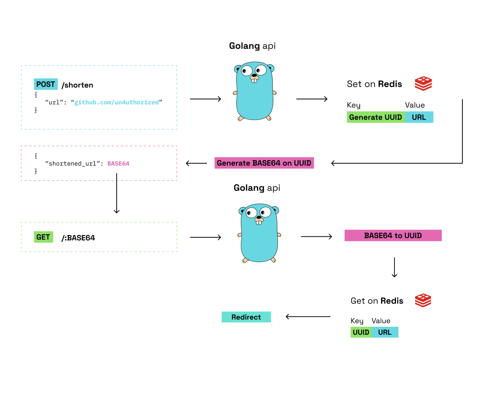

## Motivation
The motivation behind this project is to learn more about system design and how to build a scalable system. The book system design interview is a great resource to learn about system design and this project is based on the case study of building a url shortener.

## Table of Contents
- [Requirements](#requirements)
- [How to run](#how-to-run)
- [API](#api)
- [Architecture](#architecture)
- [References](#references)

## Requirements
- Docker
- Docker Compose
- Golang

## How to run
1. Clone the repository
2. Run `docker-compose up` to start the redis server
3. Run `go run main.go` to start the server
4. Run `go test ./...` to run the tests

## API
### POST /shorten
Request body:
```json
{
    "url": "https://www.google.com"
}
```
Response body:
```json
{
    "shortened_url": "http://localhost:8080/1"
}
```

### GET /:id
Response body:
```json
{
    "url": "https://www.google.com"
}
```

## Architecture


## References
- [System Design Interview](https://www.amazon.com/System-Design-Interview-insiders-Second/dp/B08CMF2CQF)
